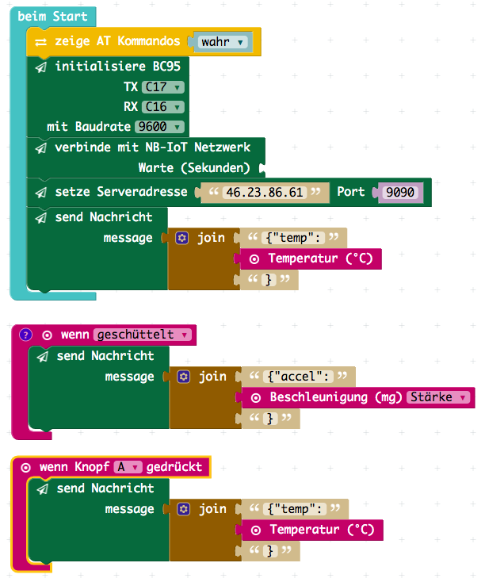

# Calliope mini BC95 NB-IoT module

This is a package for controlling an NB-IoT module to send messages from the Calliope mini.
It can be used by the [PXT Calliope mini editor](https://pxt.calliope.cc/). Should also work
with PXT for Micro:bit.

More information on the module can be found on the [Quectel website](http://www.quectel.com/product/bc95.htm).
It is used in conjunction with an [evaluation kit](http://www.quectel.com/product/gsmevb.htm).

The code may be used as a starting point for similar AT based systems.

## Testing

- Modify `tests.ts` to send packages to your own server.
- Execute a little server: `nc -vv -ul -p 5883` (Linux, also echos the messages) 
- Compile the test `pxt test` and copy `built/binary.hex` to the Calliope mini.

On the USB console window you will see this:

```
START TEST
TEST: modem working: OK
TEST: enable all functionality: OK
TEST: check IMSI: OK
TEST: connect to network: OK
TEST: check signal quality: OK
TEST: check network stats: OK
TEST: check PDP context: OK
TEST: check address: OK
TEST: check band: OK
TEST: ping external server: OK
TEST: expect ping reply: OK
TEST: sending number: OK
TEST: sending string: OK
TEST FINISHED OK
``` 

> You can follow the AT flow on the USB serial console by enabling debug in `tests.ts`

The server should show something like this:

```
connect to [46.23.86.61] from tmo-121-137.customers.d1-online.com [80.187.121.137] 25519
 {"id":"bc9ab239","p":{"test":123}}{"id":"bc9ab239","p":{"test":"value 123"}}
```

## Example

### Blocks


### Javascript

```typescript
input.onButtonPressed(Button.A, () => {
    bc95.sendString(
        "Hallo",
        "Calliope mini"
    )
    if (bc95.sendOk()) {
        basic.showIcon(IconNames.Yes)
    } else {
        basic.showIcon(IconNames.No)
    }
    basic.pause(1000)
    basic.clearScreen()
})
input.onButtonPressed(Button.B, () => {
    bc95.sendNumber(
        "t",
        input.temperature()
    )
    if (bc95.sendOk()) {
        basic.showIcon(IconNames.Yes)
    } else {
        basic.showIcon(IconNames.No)
    }
    basic.pause(1000)
    basic.clearScreen()
})
bc95.init(
    SerialPin.C17,
    SerialPin.C16,
    BaudRate.BaudRate9600
)
bc95.attach()
bc95.setServer("46.23.86.61", 5883)
```

```
$ listening on [any] 5883 ...
  connect to [46.23.86.61] from tmo-121-137.customers.d1-online.com [80.187.121.137] 24189
  {"id":"bc9ab239","p":{"t":29}}{"id":"bc9ab239","p":{"Hallo":"Calliope mini"}}

```

## TODO

- extract AT response parsing into its own module, to make it usable for other devices
- handle incoming messages

## Meta

- PXT/calliope
- PXT/microbit

Author: Matthias L. Jugel ([@thinkberg](https://twitter.com/thinkberg))

## License

MIT